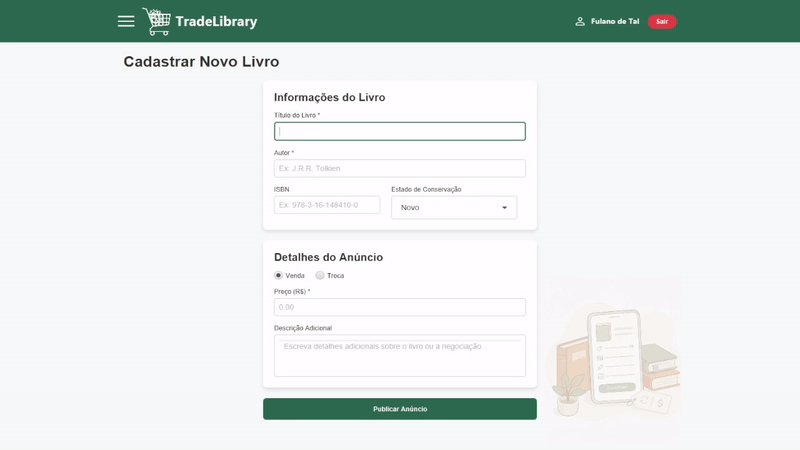
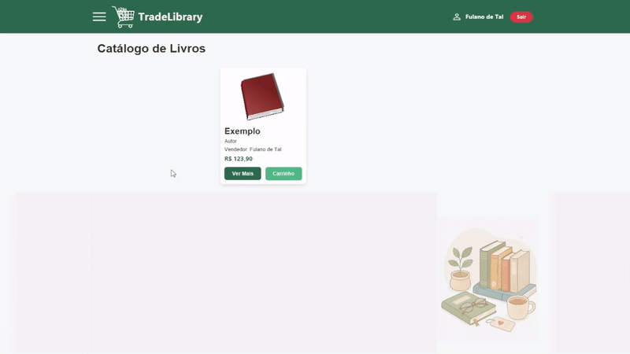
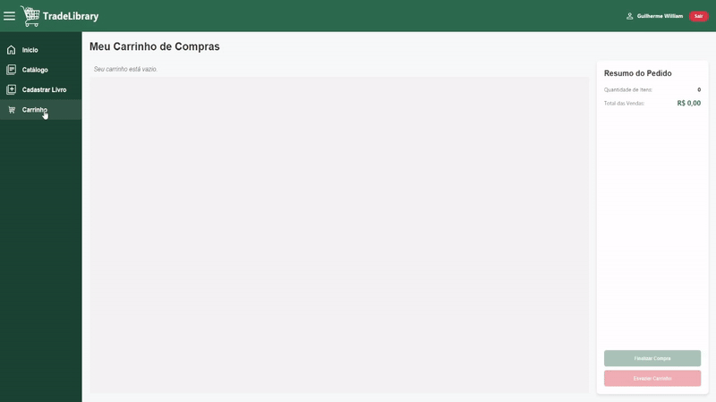
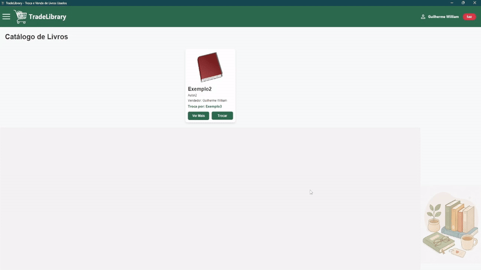
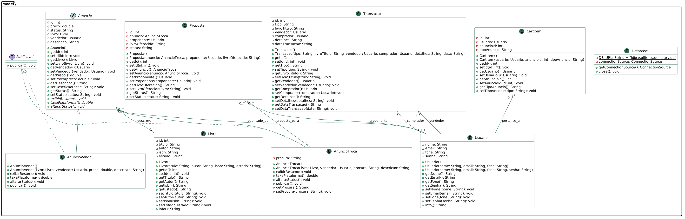
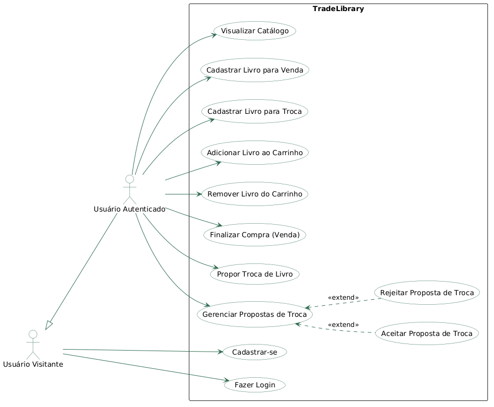
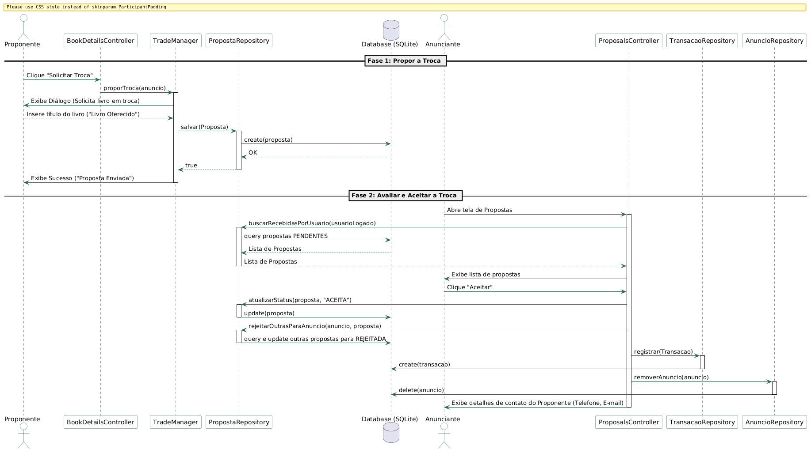
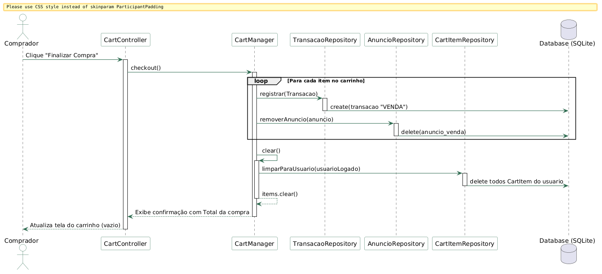

# TradeLibrary - Troca e Venda de Livros Usados

<p align="center">
  
  
</p>

<div align="center">
  
[](https://www.java.com)
[](https://openjfx.io/)
[](https://www.sqlite.org/)

</div>

O **TradeLibrary** é um sistema desktop *Peer-to-Peer* (P2P) desenvolvido em Java e JavaFX para facilitar a compra, venda e troca de livros novos e usados. O projeto aplica conceitos sólidos de Programação Orientada a Objetos (POO), arquitetura MVC e persistência de dados local sem o uso de servidores externos.

---

## Preview do Programa Funcionando

<p align="center">
  
</p>
<p align="center"><em>Figura 1: Cadastro de usuário</em></p>

<p align="center">
  
</p>
<p align="center"><em>Figura 2: Login de usuário</em></p>

<p align="center">
  
</p>
<p align="center"><em>Figura 3: Cadastro de livro</em></p>

<p align="center">
  
</p>
<p align="center"><em>Figura 4: Livro cadastrado à venda</em></p>

<p align="center">
  
</p>
<p align="center"><em>Figura 5: Compra de livro</em></p>

<p align="center">
  
</p>
<p align="center"><em>Figura 6: Troca de livro</em></p>

---

## 📂 Estrutura de Pastas

O projeto adota a arquitetura MVC (Model-View-Controller) para manter a separação de responsabilidades e facilitar a manutenção:

```text
g5/
├── controller/         # Controladores JavaFX (Eventos e validações visuais)
├── docs/               # Documentação técnica detalhada (ADRs, regras e guias)
├── lib/                # Bibliotecas de dependência (JavaFX, ORMLite, SQLite)
├── model/              # Classes de domínio, Repositórios e lógica de negócio em Java
├── resources/          # Arquivos estáticos e logotipos do sistema
├── view/               # Telas do sistema em FXML e estilização CSS
├── .vscode/            # Configurações de execução e debug do VS Code
├── Main.java           # Ponto de entrada (Entrypoint) da aplicação
└── tradelibrary.db     # Banco de dados local SQLite (Autogerado)
```

## Pré-requisitos

- **JDK 25 ou superior** — recomendado: [Eclipse Temurin](https://adoptium.net/)
- **JavaFX SDK 26** — baixar em: [https://gluonhq.com/products/javafx/](https://gluonhq.com/products/javafx/)

## Configuração inicial (faça uma vez)

### 1. Clonar o repositório

```bash
git clone https://github.com/<seu-usuario>/g5.git
cd g5
```

### 2. Adicionar os arquivos nativos do JavaFX na pasta `lib/`

A pasta `lib/` já contém os arquivos `.jar` do JavaFX.
Você precisa copiar os arquivos `.dll` (Windows) da pasta `bin/` do seu SDK para a pasta `lib/` do projeto:

```
Copie de: C:\caminho-para-seu-sdk\javafx-sdk-26\bin\*.dll
     Para: g5\lib\
```

> ⚠️ Os `.dll` não são versionados no Git por serem específicos de cada sistema operacional.

---

## Como executar

### VS Code
1. Abra a pasta `g5/` no VS Code
2. Instale a extensão **"Extension Pack for Java"** se ainda não tiver
3. Vá em **Run and Debug** (Ctrl+Shift+D)
4. Escolha **"Run Main (JavaFX)"** para abrir a interface gráfica
5. Ou escolha **"Run TestePublicavel"** / **"Run TesteMarketplace"** para os testes em console

### Eclipse IDE
1. Importe o projeto: **File → Import → Existing Projects into Workspace**
2. Configure os VM Arguments na Run Configuration do `Main`:
   - **Run → Run Configurations → Arguments → VM arguments:**
   ```
   --module-path "C:\caminho-para-seu-sdk\javafx-sdk-26\lib" --add-modules javafx.controls,javafx.fxml --enable-native-access=javafx.graphics
   ```
3. Para `TestePublicavel` e `TesteMarketplace` não é necessário nenhuma configuração extra.

---


## 🏛️ Diagrama de Classes
Abaixo está a representação estrutural do domínio principal do TradeLibrary, demonstrando a herança polimórfica dos anúncios.


## 🔄 Melhorias Realizadas desde a Primeira Entrega

1.  **Mecanismo de Carrinho de Compras**: Adicionada a possibilidade de comprar múltiplos livros à venda em lote.
2.  **Mecanismo de Propostas**: Fluxo completo de proposta e aceitação de trocas em tempo real, integrando a lógica de negócio de aceitar/rejeitar propostas concorrentes automaticamente.
3.  **Persistência Integrada**: Inclusão de tabelas adicionais para carrinho, propostas e histórico de transações finalizadas no SQLite.
4.  **Correção e Entrega do UML**: Criação de diagramas de classes, casos de uso e diagramas de sequência com arquivos-fonte do PlantUML (`.puml`) e exportações de imagem integradas localmente na documentação.
5.  **Padronização Geral de Diretórios**: Reorganização estrutural para a pasta `/docs/` e remoção completa de referências a caminhos locais absolutos dos desenvolvedores em toda a documentação.

---

## 🎨 Diagramas UML do Projeto

### Diagrama de Classes
Mapeamento estrutural de todo o domínio de dados, repositórios de dados e relacionamentos de persistência.



---

### Diagrama de Casos de Uso
Casos de uso suportados pela aplicação por usuários visitantes e usuários autenticados.



---

### Diagrama de Sequência: Fluxo de Troca (Escambo)
Representação da sequência de chamadas de métodos para o envio e a aceitação de uma proposta de troca.



---

### Diagrama de Sequência: Fluxo de Venda/Compra
Representação da sequência de chamadas para o checkout de livros adicionados ao carrinho de compras.



---

## 👥 Membros da Equipe

*   **Bruno Barreto** (Engenheiro de Backend)
*   **Cristiano Ribeiro** (Arquiteto de Software e UML)
*   **Dermival** (Engenheiro de Frontend)
*   **Gabriel Bueno** (Líder da Equipe e Engenheiro de Segurança)
*   **Guilherme William** (Engenheiro de Frontend)

