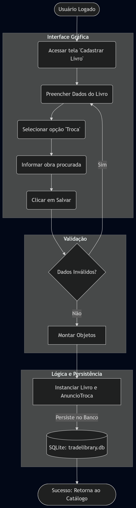

# TradeLibrary - Troca e Venda de Livros Usados

<p align="center">
  
</p>

O **TradeLibrary** é um sistema desktop *Peer-to-Peer* (P2P) desenvolvido em Java e JavaFX para facilitar a compra, venda e troca de livros novos e usados. O projeto aplica conceitos sólidos de Programação Orientada a Objetos (POO), arquitetura MVC e persistência de dados local sem o uso de servidores externos.

---

## 📂 Estrutura de Pastas

O projeto adota a arquitetura MVC (Model-View-Controller) para manter a separação de responsabilidades e facilitar a manutenção:

```text
g5/
├── controller/         # Controladores JavaFX (Eventos e validações visuais)
├── docs/               # Documentação técnica detalhada (ADRs, regras e guias)
├── lib/                # Bibliotecas de dependência (JavaFX, ORMLite, SQLite)
├── model/              # Classes de domínio, Repositórios e lógica de negócio em Java
├── resources/          # Arquivos estáticos e logotipos do sistema
├── view/               # Telas do sistema em FXML e estilização CSS
├── .vscode/            # Configurações de execução e debug do VS Code
├── Main.java           # Ponto de entrada (Entrypoint) da aplicação
└── tradelibrary.db     # Banco de dados local SQLite (Autogerado)
```

## Pré-requisitos

- JDK 25 ou superior** — recomendado: [Eclipse Temurin](https://adoptium.net/)
- **JavaFX SDK 26** — baixar em: [https://gluonhq.com/products/javafx/](https://gluonhq.com/products/javafx/)

## Configuração inicial (faça uma vez)

### 1. Clonar o repositório

```bash
git clone https://github.com/<seu-usuario>/g5.git
cd g5
```

### 2. Adicionar os arquivos nativos do JavaFX na pasta `lib/`

A pasta `lib/` já contém os arquivos `.jar` do JavaFX.
Você precisa copiar os arquivos `.dll` (Windows) da pasta `bin/` do seu SDK para a pasta `lib/` do projeto:

```
Copie de: C:\caminho-para-seu-sdk\javafx-sdk-26\bin\*.dll
     Para: g5\lib\
```

> ⚠️ Os `.dll` não são versionados no Git por serem específicos de cada sistema operacional.

---

## Como executar

### VS Code
1. Abra a pasta `g5/` no VS Code
2. Instale a extensão **"Extension Pack for Java"** se ainda não tiver
3. Vá em **Run and Debug** (Ctrl+Shift+D)
4. Escolha **"Run Main (JavaFX)"** para abrir a interface gráfica
5. Ou escolha **"Run TestePublicavel"** / **"Run TesteMarketplace"** para os testes em console

### Eclipse IDE
1. Importe o projeto: **File → Import → Existing Projects into Workspace**
2. Configure os VM Arguments na Run Configuration do `Main`:
   - **Run → Run Configurations → Arguments → VM arguments:**
   ```
   --module-path "C:\caminho-para-seu-sdk\javafx-sdk-26\lib" --add-modules javafx.controls,javafx.fxml --enable-native-access=javafx.graphics
   ```
3. Para `TestePublicavel` e `TesteMarketplace` não é necessário nenhuma configuração extra.

---


## 🏛️ Diagrama de Classes
Abaixo está a representação estrutural do domínio principal do TradeLibrary, demonstrando a herança polimórfica dos anúncios.


---


## 🔄 Fluxo de Caso de Uso: Troca de Livros

Este diagrama representa o fluxo principal de um usuário utilizando o sistema para cadastrar um interesse de troca.

