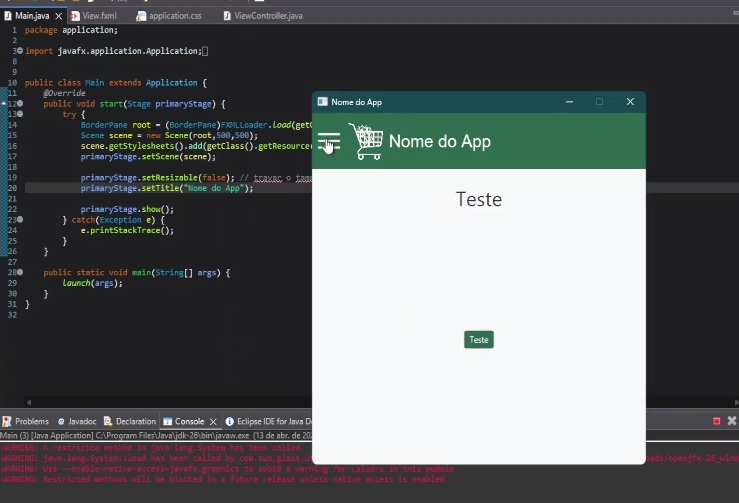
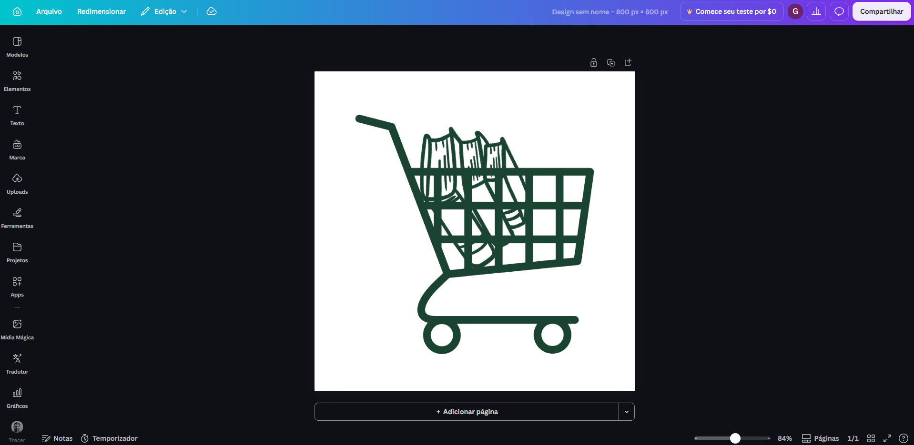
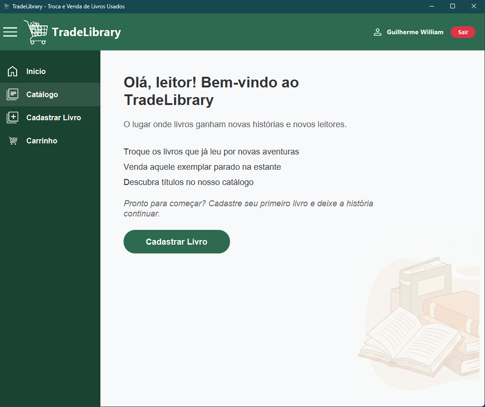
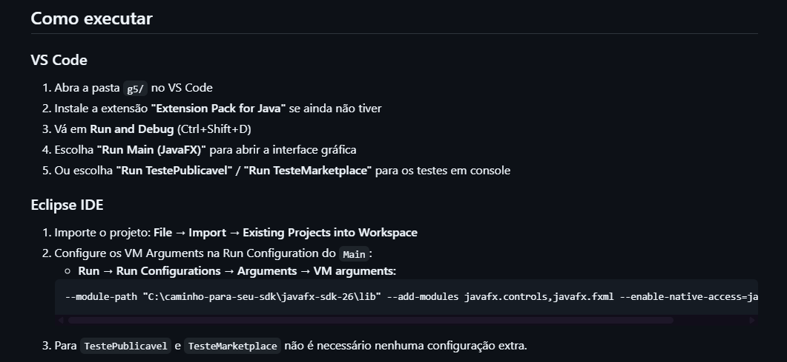

# Relatório Individual Final - Projeto POO

## Obs: A maior parte do texto é o mesmo do relatório anterior pois não mudou muita coisa entre aquele relatório e esse

**Projeto:** TradeLibrary (Plataforma de Troca e Venda de Livros)

**Desenvolvedor:** Guilherme William

## 1. Atribuição de Cargo e Tarefas
No projeto, fui designado primariamente para atuar no **Frontend**. Minha responsabilidade inicial era desenvolver a interface gráfica do programa e garantir uma boa experiência de usuário. Além de escrever o código das telas, decidi tratar o projeto com a visão de um "produto" real. Para isso, fui responsável por definir o nome do sistema, que batizei de **TradeLibrary** (unindo "Trade" de troca e "Library" de livraria, remetendo diretamente ao propósito da aplicação). Também fiquei encarregado da identidade visual: criei o logotipo (um carrinho de compras branco com livros, desenhado no Canva para remeter a um *marketplace*) e defini a paleta de cores, focada em tons de verde escuro para transmitir uma *vibe* de sustentabilidade atrelada à reutilização de livros.

<em>Figura 1: Primeira versão do design da interface</em>

<em>Figura 2: Logotipo criado no Canva</em>

<em>Figura 3: Versão refeita da tela inicial</em>

## 2. Contribuição de Acordo com a Atribuição
Cumpri com a elaboração da interface gráfica inicial e o design system da aplicação, mantendo a responsabilidade sobre o Frontend até a etapa final do projeto.

**O que foi cumprido e documentos relevantes:**
* Criação da tela inicial do programa, incluindo a implementação funcional de um menu hambúrguer, com limitação do redimensionamento da janela para evitar que elementos visuais (como a imagem do livro na tela inicial) desaparecessem em telas menores.
* Desenvolvimento das telas de formulário para cadastro de um livro.
* Criação da tela de exibição dos livros ofertados (inicialmente com dados *mockados*, enquanto o backend dessa funcionalidade ainda não estava concluído).
* Refinamento visual da interface com a adição de ícones integrados do *Google Material Icons*.
* **(Etapa Final)** Implementação do front-end dos alertas padrão (*Alert*) do JavaFX, utilizados para exibir pop-ups de notificação e confirmação ao usuário na interface.

**Principais commits relacionados:**
* *Commit de criação da estrutura inicial do Frontend, identidade visual e menu principal.*
* *Commit de atualização do Frontend (Telas de formulários de livros, feed de ofertas mockado e ícones).*
* *Commit de redesign implementação dos alertas (Alert) padrão do JavaFX na interface.*

**Principais dificuldades e o que não deu para cumprir:**
Houve um período em que fiquei sem produzir novas telas após a entrega da tela inicial, pois a dinâmica de integração demandava um backend mais estruturado. Já na reta final do projeto, fiquei um período sem acesso à internet, o que limitou bastante minha capacidade de continuar avançando no Frontend nessa etapa — por esse motivo, minha contribuição final ficou restrita à implementação do Alert padrão do JavaFX, sem novas telas ou funcionalidades maiores em relação à apresentação anterior.

## 3. Contribuição Além do Atribuído
Embora minha atribuição original fosse estritamente o Frontend, acabei assumindo diversas tarefas de configuração de ambiente e Backend para garantir que a equipe conseguisse avançar no desenvolvimento.

**Como ajudei a equipe e o projeto:**
* **Resolução de Problemas de Ambiente:** Durante as aulas práticas, notei que o programa não abria para os meus colegas de grupo. Adaptei a estrutura do projeto para ser compatível com as IDEs mais comuns utilizadas pela equipe (Eclipse, BlueJ e VS Code). Criei uma pasta específica com os arquivos do JavaFX e elaborei um tutorial passo a passo no `README.md` detalhando como executar o projeto sem problemas de biblioteca.
* **Implementação de Banco de Dados e Persistência:** Após a aula de banco de dados, tomei a iniciativa de implementar essa *feature*. Configurei a persistência de dados utilizando **SQLite** e **ORMLite**.
* **Integração Front-Back:** Criei a tela de login e o cadastro de novos usuários, realizando a integração com as classes de Usuário do backend, que até então estavam independentes do front. Os dados passaram a permanecer salvos no banco local mesmo fechando e abrindo o programa. Esse trabalho inicial serviu de base para que os colegas de projeto aprimorassem o sistema de login posteriormente.
* **Organização de Código de Terceiros:** Logo no meu primeiro commit, acabei subindo e organizando parte do código de backend que o colega Bruno havia feito, mas não tinha commitado no repositório.

**Commits e documentos extras mais relevantes:**
* *Commit de correção de compatibilidade (Configuração de bibliotecas JavaFX para diferentes IDEs e criação do tutorial no README).*
* *Commit de implementação de persistência (Integração SQLite + ORMLite, criação de Login/Cadastro e integração das classes de Usuário do backend).*

<em>Figura 4: Print do README com instruções de execução</em>

## 4. Considerações Gerais

**O que aprendi:**
Ao longo de todo o projeto, tive um imenso aprendizado prático. Evoluí bastante na criação de interfaces gráficas e manipulação de componentes visuais, e pude perceber na prática as semelhanças e limitações do FXML e do CSS do JavaFX em comparação ao HTML/CSS tradicional, especialmente quanto à organização de conteúdo responsivo. O maior ganho, no entanto, veio de resolver problemas reais de integração: aprendi a lidar com incompatibilidades de ambiente entre diferentes IDEs e a configurar dependências externas de forma clara para o time. Além disso, aplicar os conceitos de persistência de dados com SQLite e ORMLite na prática uniu os conceitos de POO com o armazenamento permanente, algo essencial para qualquer software. Na etapa final, mesmo com a contribuição reduzida devido à falta de internet, a implementação dos Alerts do JavaFX reforçou o entendimento sobre os componentes prontos que o próprio framework disponibiliza para comunicação com o usuário.

<em>Figura 5: Exibição de dados salvos de usuários no banco local</em>

<em>Figura 6: Exibição de dados salvos de livros no banco local</em>

## 5. Apresentação em vídeo do relatório
* [Vídeo apresentando minha contribuição (Google Drive)](https://drive.google.com/file/d/1wF7Hxl4aNxy9qzFC-tZbF5ezBoG0Fz1Q/view?usp=sharing)