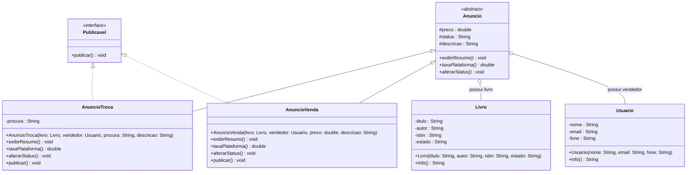

```mermaid
classDiagram
    class Publicavel {
        <<interface>>
        +publicar() void
    }

    class Anuncio {
        <<abstract>>
        #preco : double
        #status : String
        #descricao : String
        +exibirResumo()* void
        +taxaPlataforma()* double
        +alterarStatus()* void
    }

    class AnuncioVenda {
        +AnuncioVenda(livro: Livro, vendedor: Usuario, preco: double, descricao: String)
        +exibirResumo() void
        +taxaPlataforma() double
        +alterarStatus() void
        +publicar() void
    }

    class AnuncioTroca {
        -procura : String
        +AnuncioTroca(livro: Livro, vendedor: Usuario, procura: String, descricao: String)
        +exibirResumo() void
        +taxaPlataforma() double
        +alterarStatus() void
        +publicar() void
    }

    class Usuario {
        -nome : String
        -email : String
        -fone : String
        +Usuario(nome: String, email: String, fone: String)
        +info() String
    }

    class Livro {
        -titulo : String
        -autor : String
        -isbn : String
        -estado : String
        +Livro(titulo: String, autor: String, isbn: String, estado: String)
        +info() String
    }

    Anuncio o-- Usuario : possui vendedor
    Anuncio o-- Livro : possui livro

    Anuncio <|-- AnuncioVenda
    Anuncio <|-- AnuncioTroca

    Publicavel <|.. AnuncioVenda
    Publicavel <|.. AnuncioTroca
```
